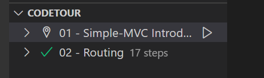

# Description du Projet StatsGite
Le projet StrasGite est une plateforme dynamique créée en PHP. Son objectif est de fournir une plateforme permettant de réserver des chambres d'hôtes. Le site est développé selon le modèle MVC et intègre une base de données pour enregistrer les réservations. De plus, il dispose d'un Back-Office qui permet à l'administrateur d'ajouter, de modifier et de supprimer des chambres.

## Développement du site.

Il s'agit du deuxième projet de formation créé au sein de la Wild Code School après deux mois de formation. Ce travail collaboratif a été réalisé par 3 personnes dans le but de mettre en pratique les connaissances acquises en développement back-end, principalement en PHP.

## Critères imposés

#### Plusieurs critères ont été imposés pour le projet :

* Durée de réalisation : 5 semaines.
* 100% responsive.
* Utilisation de la méthode simple MVC.
* Utilisation de la méthode agile.
* Base de données : modèle logique des données (MLD) avec utilisation de MySQL. Réalisation d'un CRUD (Create, Read, Update, Delete).
* GIT / GIT HUB.

### Techonologies utilisées

Les technologies utilisées sont :

* HTML
* CSS
* TWIG
* PHP 8.0
* MySQL
* Composer
* PHPMailer
* GIT

## Travail personel

Pour ce projet, j'ai principalement travaillé sur :
* la page de présentations des chambres
* la page contact
* le Navbar et le Footer de chaque page
* l'envoi des mails après avoir confirmé la reservation

<a href="https://ibb.co/mXrD6DP"></a>

<a href="https://ibb.co/vsrvYWJ"></a>

### Quelques images du site.

<a href="https://ibb.co/SrZqQpF"></a>

<a href="https://ibb.co/CWfDxdH"></a>

<a href="https://ibb.co/Qn2sHN4"></a>

<a href="https://ibb.co/7pDDvZW"></a>

### Les étapes pour visualiser le projet

#### Pour la visualisation du projet il faut suivre les étapes suivantes:

1. Clonez le repository depuis Github.
Exécutez la commande composer install sur votre terminal.
Créez config/db.php à partir du fichier config/db.php.dist et ajoutez les paramètres de votre base de données. Ne supprimez pas le fichier .dist, il doit être conservé.
define('APP_DB_HOST', 'your_db_host');
define('APP_DB_NAME', 'your_db_name');
define('APP_DB_USER', 'your_db_user_wich_is_not_root');
define('APP_DB_PASSWORD', 'your_db_password');
Importez database.sql dans votre serveur SQL, vous pouvez le faire manuellement ou utiliser le script migration.php qui importera un fichier database.sql.
Lancez le serveur web PHP interne avec php -S localhost:8000 -t public/. L'option -t avec public comme paramètre signifie que votre hôte local ciblera le dossier /public.
Allez sur localhost:8000 avec votre navigateur préféré.
À partir de ce kit de démarrage, créez votre propre application web.
Utilisateurs Windows
Si vous développez sous Windows, vous devez éditer votre configuration git pour changer vos règles de fin de ligne avec cette commande :

git config --global core.autocrlf true
## Description

This repository is a simple PHP MVC structure from scratch.

It uses some cool vendors/libraries such as Twig and Grumphp.
For this one, just a simple example where users can choose one of their databases and see tables in it.

## Steps

1. Clone the repo from Github.
2. Run `composer install`.
3. Create _config/db.php_ from _config/db.php.dist_ file and add your DB parameters. Don't delete the _.dist_ file, it must be kept.

```php
define('APP_DB_HOST', 'your_db_host');
define('APP_DB_NAME', 'your_db_name');
define('APP_DB_USER', 'your_db_user_wich_is_not_root');
define('APP_DB_PASSWORD', 'your_db_password');
```

4. Import _database.sql_ in your SQL server, you can do it manually or use the _migration.php_ script which will import a _database.sql_ file.
5. Run the internal PHP webserver with `php -S localhost:8000 -t public/`. The option `-t` with `public` as parameter means your localhost will target the `/public` folder.
6. Go to `localhost:8000` with your favorite browser.
7. From this starter kit, create your own web application.

### Windows Users

If you develop on Windows, you should edit you git configuration to change your end of line rules with this command :

`git config --global core.autocrlf true`

## Example

An example (a basic list of items) is provided (you can load the _simple-mvc.sql_ file in a test database). The accessible URLs are :

-   Home page at [localhost:8000/](localhost:8000/)
-   Items list at [localhost:8000/items](localhost:8000/items)
-   Item details [localhost:8000/items/show?id=:id](localhost:8000/item/show?id=2)
-   Item edit [localhost:8000/items/edit?id=:id](localhost:8000/items/edit?id=2)
-   Item add [localhost:8000/items/add](localhost:8000/items/add)
-   Item deletion [localhost:8000/items/delete?id=:id](localhost:8000/items/delete?id=2)

You can find all these routes declared in the file `src/routes.php`. This is the very same file where you'll add your own new routes to the application.

## How does URL routing work ?


## Ask for a tour !


We prepare a little guided tour to start with the simple-MVC.

To take it, you need to install the `Code Tour` extension for Visual Studio Code : [Code Tour](https://marketplace.visualstudio.com/items?itemName=vsls-contrib.codetour)

It will give access to a new menu on your IDE where you'll find the different tours about the simple-MVC. Click on play to start one :



## Run it on docker

If you don't know what is docker, skip this chapter. ;)

Otherwise, you probably see, this project is ready to use with docker.

To build the image, go into the project directory and in your CLI type:

```
docker build -t simple-mvc-container .
```

then, run it to open it on your localhot :

```
docker run -i -t --name simple-mvc  -p 80:80 simple-mvc-container
```
